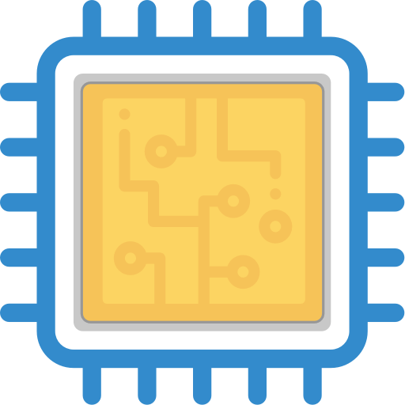
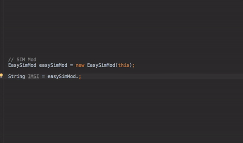
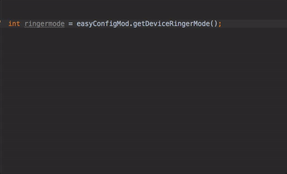

<div align="center">
  
</div>

<h1 align="center">EasyDeviceInfo <a href="https://twitter.com/intent/tweet?text=EasyDeviceInfo%3A%20Android%20library%20to%20get%20device%20information%20in%20a%20super%20easy%20way%F0%9F%98%8E&url=https://github.com/nisrulz/easydeviceinfo&via=nisrulz&hashtags=AndroidDev">
        
    </a></h1>

<div align="center">
  <strong>Android library to get device information in a super easy way.</strong>
  <p>The library is built for simplicity and approachability. It not only eliminates most boilerplate code for dealing with device information, but also provides an easy and simple API to retrieve them</p>
</div>
<br/>
<div align="center">
    <!-- Bintray -->
    <a href="https://bintray.com/nisrulz/maven/com.github.nisrulz%3Aeasydeviceinfo/_latestVersion">
        
    </a>
    <!-- API -->
    <a href="https://android-arsenal.com/api?level=14">
        
    </a>
    <!-- Android Arsenal -->
    <a href="https://android-arsenal.com/details/1/3562">
        
    </a>
     <!-- Android Dev Digest -->
    <a href="https://www.androiddevdigest.com/digest-99/">
        
    </a>
    <!-- Android Weekly -->
    <a href="http://androidweekly.net/issues/issue-209">
        
    </a>
    <!-- Awesome Android -->
    <a href="https://snowdream.github.io/awesome-android/Other.html#Utility">
        
    </a>
    <!-- GitHub stars -->
    <a href="https://github.com/nisrulz/easydeviceinfo">
        
    </a>
    <!-- GitHub forks -->
    <a href="https://github.com/nisrulz/easydeviceinfo/fork">
        
    </a>
    <!-- GitHub watchers -->
    <a href="https://github.com/nisrulz/easydeviceinfo">
        
    </a>
    <!-- Say Thanks! -->
    <a href="https://saythanks.io/to/nisrulz">
        
    </a>
    <a href="https://www.paypal.me/nisrulz/5">
        
    </a>
    <br/>
     <!-- GitHub followers -->
    <a href="https://github.com/nisrulz/easydeviceinfo">
        
    </a>
    <!-- Twitter Follow -->
    <a href="https://twitter.com/nisrulz">
        
    </a>
</div>

<div align="center">
    Also featured in
    <a href="https://android.libhunt.com/newsletter/9">
        Awesome Android Newsletter #Issue 9
    </a>, 
    <a href="http://email.changelog.com/t/t-C0123E3CCEDED6A6">
        Changelog Weekly Issue #114
    </a>
</div>

<div align="center">
  <sub>Built with ❤︎ by
  <a href="https://twitter.com/nisrulz">Nishant Srivastava</a> and
  <a href="https://github.com/nisrulz/easydeviceinfo/graphs/contributors">
    contributors
  </a>
</div>
<br/>
<br/>

#### **Note**
EasyDeviceInfo is split into multiple module-libraries , v2.2.0 onwards. Use the appropriate one as per your requirement.

+  `easydeviceinfo`
    - Main library which transitively includes both `easydeviceinfo-ads` and `easydeviceinfo-base`.

+ `easydeviceinfo-ads`
    -  EasyDeviceInfo Ads, which facilitates information regarding ads. Has a dependency on `play-services-base`.
    -  **Supported Mods**
        + [EasyAdsMod](https://github.com/nisrulz/easydeviceinfo/wiki/Usage#easyadsmod)
+ `easydeviceinfo-base`
    -  EasyDeviceInfo Base, which facilitates information regarding the device.
    -  **Supported Mods**
        + [EasyAppMod](https://github.com/nisrulz/easydeviceinfo/wiki/Usage#easyappmod)
        + [EasyBatteryMod](https://github.com/nisrulz/easydeviceinfo/wiki/Usage#easybatterymod)
        + [EasyBluetoothMod](https://github.com/nisrulz/easydeviceinfo/wiki/Usage#easybluetoothmod)
        + [EasyConfigMod](https://github.com/nisrulz/easydeviceinfo/wiki/Usage#easyconfigmod)
        + [EasyCpuMod](https://github.com/nisrulz/easydeviceinfo/wiki/Usage#easycpumod)
        + [EasyDeviceMod](https://github.com/nisrulz/easydeviceinfo/wiki/Usage#easydevicemod)
        + [EasyDisplayMod](https://github.com/nisrulz/easydeviceinfo/wiki/Usage#easydisplaymod)
        + [EasyIdMod](https://github.com/nisrulz/easydeviceinfo/wiki/Usage#easyidmod)
        + [EasyLocationMod](https://github.com/nisrulz/easydeviceinfo/wiki/Usage#easylocationmod)
        + [EasyMemoryMod](https://github.com/nisrulz/easydeviceinfo/wiki/Usage#easymemorymod)
        + [EasyNetworkMod](https://github.com/nisrulz/easydeviceinfo/wiki/Usage#easynetworkmod)
        + [EasyNfcMod](https://github.com/nisrulz/easydeviceinfo/wiki/Usage#easynfcmod)
        + [EasySimMod](https://github.com/nisrulz/easydeviceinfo/wiki/Usage#easysimmod)
        + [EasySensorMod](https://github.com/nisrulz/easydeviceinfo/wiki/Usage#easysensormod)
        + [EasyFingerprintMod](https://github.com/nisrulz/easydeviceinfo/wiki/Usage#easyfingerprintmod)

# Changelog

Starting with `1.1.8`, Changes exist in the [releases tab](https://github.com/nisrulz/easydeviceinfo/releases).

# Including in your project
EasyDeviceInfo is available in the Jcenter, so getting it as simple as adding it as a dependency.

```gradle
dependencies {
    def easyDeviceInfoVersion = {latest version}

    // Base + Ads Bundled Library
    implementation "com.github.nisrulz:easydeviceinfo:$easyDeviceInfoVersion"

    // Base Composite
    implementation "com.github.nisrulz:easydeviceinfo-base:$easyDeviceInfoVersion"

    // Ads Composite
    implementation "com.github.nisrulz:easydeviceinfo-ads:$easyDeviceInfoVersion"
}

```

where `{latest version}` corresponds to published version in Jcenter
+ `easydeviceinfo` - [  ](https://bintray.com/nisrulz/maven/com.github.nisrulz%3Aeasydeviceinfo/_latestVersion)
+	`easydeviceinfo-ads` - [  ](https://bintray.com/nisrulz/maven/easydeviceinfo-ads/_latestVersion)
+	`easydeviceinfo-base` - [  ](https://bintray.com/nisrulz/maven/easydeviceinfo-base/_latestVersion)

# Usage Docs/Wiki

Introducing **Mods** in **EasyDeviceInfo v2**!

 ***Mods*** or ***Modules*** are the new way to retrieve information. They let you get information in a very segmented manner and the best part is you only initialize the Mods you need in your project. Pretty rad , eh ?  I know.

> The whole api has been reworked in v2.x.x , however the functions remain the same, hence now you need to migrate to v2.x.x from 1.x.x.

### Simple example

Now to use them, create an instance of one of the Mods ( **Easy\*Mod** class ), i.e `EasyConfigMod`
```java
EasyConfigMod easyConfigMod = new EasyConfigMod(context);
```
Next call an available function on the ***easyConfigMod*** instance such as
```java
String time_in_ms= String.valueOf(easyConfigMod.getTime());
```

Now each **Mods** has a certain set of functions you can call on them to retrieve device information. i.e for  **EasyConfigMod**

|Value|functionName|returns
|---|---|---|
|Is running on emulator|`isRunningOnEmulator()`|boolean
|Time (ms)|`getTime()`|long
|Formatted Time (24Hr)|`getFormattedTime()`|String
|Up Time (ms)|`getUpTime()`|long
|Formatted Up Time (24Hr)|`getFormattedUpTime()`|String

#### Android Studio support
+ Include a required permission check
  
  

+ Setup all constants returned in a switch statement
  
  
  
  This applies to all annotations bundled with easydeviceinfo. Checkout the wiki to see where these annotations can be applied.
  + `@RingerMode`
  + `@DeviceType`
  + `@PhoneType`
  + `@OrientationType`
  + `@NetworkType`
  + `@BatteryHealth`
  + `@ChargingVia`

### :page_with_curl: For more info , check the **[Wiki Docs](https://github.com/nisrulz/easydeviceinfo/wiki/Usage)**

# Pull Requests
I welcome and encourage all pull requests. It usually will take me within 24-48 hours to respond to any issue or request. Here are some basic rules to follow to ensure timely addition of your request:
  1. Match coding style (braces, spacing, etc.) This is best achieved using CMD+Option+L (Reformat code) on Mac (not sure for Windows) with Android Studio defaults. This project uses a [modified version of Grandcentrix's code style](https://github.com/nisrulz/AndroidCodeStyle/tree/nishant-config), so please use the same when editing this project.
  2. If its a feature, bugfix, or anything please only change code to what you specify.
  3. Please keep PR titles easy to read and descriptive of changes, this will make them easier to merge :)
  4. Pull requests _must_ be made against `develop` branch. Any other branch (unless specified by the maintainers) will get rejected.
  5. Check for existing [issues](https://github.com/nisrulz/easydeviceinfo/issues) first, before filing an issue.  
  6. Have fun!

## Apps using EasyDeviceInfo
If you are using EasyDeviceInfo in your app and would like to be listed here, please let me know by opening a [new issue](https://github.com/nisrulz/easydeviceinfo/issues/new)!

 * EasyDeviceInfo - [Playstore](https://play.google.com/store/apps/details?id=in.excogitation.deviceinfo)
 * System Tweaker - [Playstore](https://play.google.com/store/apps/details?id=com.nowenui.systemtweaker), [Github](https://github.com/AlexanderKirillov/System-Tweaker-FREE)

 [Other apps using EasyDeviceInfo, via AppBrain Stats](https://www.appbrain.com/stats/libraries/details/easydeviceinfo/easydeviceinfo)

## Author & support
This project was created by [Nishant Srivastava](https://github.com/nisrulz/nisrulz.github.io#nishant-srivastava) but hopefully developed and maintained by many others. See the [the list of contributors here](https://github.com/nisrulz/easydeviceinfo/graphs/contributors).

> If you appreciate my work, consider buying me a cup of :coffee: to keep me recharged :metal:
>  + [PayPal](https://www.paypal.me/nisrulz/5)
>  + Bitcoin Address: 13PjuJcfVW2Ad81fawqwLtku4bZLv1AxCL
>
> I love using my work and I'm available for contract work. Freelancing helps to maintain and keep [my open source projects](https://github.com/nisrulz/) up to date!

